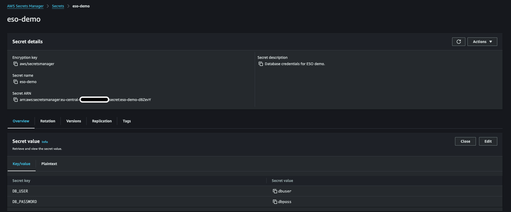

# External Secrets Operator - Demo

This demo showcases how to securely manage Kubernetes secrets using [External Secrets Operator](https://srekubecraft.io/posts/eso/). Follow the steps below to deploy the External Secrets Operator on an EKS cluster and connect it with AWS Secrets Manager.

# Directory Structure

```bash
.
├── eso-demo.yaml
├── external-secrets-operator
│   ├── conf
│   │   └── deploy.tfvars
│   ├── data.tf
│   ├── eso.tf
│   ├── locals.tf
│   ├── provider.tf
│   └── variables.tf
├── infrastructure
│   ├── cluster.tf
│   ├── conf
│   │   └── deploy.tfvars
│   ├── data.tf
│   ├── iam.tf
│   ├── locals.tf
│   ├── metricserver.tf
│   ├── network.tf
│   ├── outputs.tf
│   ├── providers.tf
│   └── variables.tf
└── secretstore.yaml
```

# Step 1: Clone the Repository and Navigate to the Directory

```bash
git clone https://github.com/NoNickeD/eso-demo.git

cd eso-demo/infrastructure
```

# Step 2: Pull the Latest Changes (Optional)

```bash
git pull
```

# Step 3: Set Up the EKS Cluster

Initialize and deploy the EKS cluster using OpenTofu:

```bash
tofu init

tofu plan -var-file=./conf/deploy.tfvars

tofu apply -var-file=./conf/deploy.tfvars
```

After the deployment completes, copy the `new_kubecontext_addition_command` output and run it to add the new cluster to your `kubeconfig`:

```bash
aws eks --region eu-central-1 update-kubeconfig --name eso-demo --profile sandbox --alias eso-demo
```

Verify cluster access:

```bash
kubectl get pods -A
```

# Step 4: Deploy External Secrets Operator (ESO)

Navigate to the `external-secrets-operator` directory and deploy ESO:

```bash
cd ../external-secrets-operator

tofu init

tofu plan -var-file=./conf/deploy.tfvars

tofu apply -var-file=./conf/deploy.tfvars
```

After deployment, confirm the ESO pods are running:

```bash
kubectl --namespace external-secrets get pods
```

# Step 5: Create Secrets in AWS Secrets Manager

Using the AWS CLI, create a secret to store database credentials:

```bash
 aws secretsmanager create-secret \
    --name "eso-demo" \
    --description "Database credentials for ESO demo." \
    --secret-string '{"DB_USER":"dbuser","DB_PASSWORD":"dbpass"}' \
    --region eu-central-1 \
    --profile sandbox
```

You should now see the secret in the AWS Secrets Manager console:



# Step 6: Set Up the SecretStore in Kubernetes

Return to the root directory and apply the SecretStore configuration:

```bash
cd ../

kubectl apply -f secretstore.yaml

kubectl --namespace external-secrets get secretstores.external-secrets.io
```

If configured correctly, the SecretStore status should display `Valid`:

```bash
NAME                  AGE     STATUS   CAPABILITIES   READY
aws-secrets-manager   4m41s   Valid    ReadWrite      True
```

# Step 7: Create an ExternalSecret

Apply the `ExternalSecret` to sync the secrets from AWS Secrets Manager to Kubernetes:

```bash
kubectl apply -f eso-demo.yaml

kubectl --namespace external-secrets get externalsecrets.external-secrets.io
```

You should see a `SecretSynced` status:

```bash
NAME              STORE                 REFRESH INTERVAL   STATUS         READY
eso-demo-secret   aws-secrets-manager   1m                 SecretSynced   True
```

Then you can get `secrets` in the `external-secrets` namespace.

```bash
kubectl --namespace external-secrets get secrets
```

To retrieve the `DB_USER` and `DB_PASSWORD`, run:

```bash
kubectl --namespace external-secrets get secret eso-secret -o jsonpath='{.data.DB_USER}' | base64 --decode


kubectl --namespace external-secrets get secret eso-secret -o jsonpath='{.data.DB_PASSWORD}' | base64 --decode
```

# Step 8: Clean Up - Destroy Cluster & Delete Secret

To remove the demo setup, navigate back to the infrastructure folder and destroy the resources:

```bash
cd infrastructure

tofu destroy -var-file=./conf/deploy.tfvars
```

Then delete the AWS secret:

```bash
aws secretsmanager delete-secret \
    --secret-id "eso-demo" \
    --region eu-central-1 \
    --profile sandbox
```

Optionally, you can immediately delete without recovery:

```bash
aws secretsmanager delete-secret \
    --secret-id "eso-demo" \
    --region eu-central-1 \
    --profile sandbox \
    --force-delete-without-recovery
```
